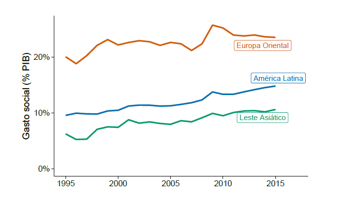

# Visualizations

This repository holds codes used for data visualization in my PhD dissertation. Actually, I will post selected graphics here, because many of them are of the same type. I used R and ggplot for all of them.

## 1. Social expenditure comparison among regions (Latin America, Easter Europe and East Asia) (Line graph)

I will plot the historical development of average social expenditure in percentage of GDP by region, particularly in Latin America, Easter Europe and East Asia. The goal is to compare how these regions have promoted public spending on social policies over the years.

Loading packpages
```
pacman::p_load(tidyverse, dplyr, tidyr, ggplot2, ggpubr, gghighlight)
```

Loading data set

```
load("data_geral.RData")
```

Creating a new variable called *region* in order to distinguish each country by region. Those are ISO-3 country codes.


```
data <- data %>% 
  mutate(region = case_when(ccode %in% c("CHN", "SGP", "HKG",
                            "JPN", "KOR","IDN",
                            "MYS", "PHL", "THA",
                            "VNM") ~ "Leste Asiático", # East Asia
                            ccode %in% c("CZE", "POL",
                            "SVK", "SVN", "LVA", "LTU", "MYS", "EST", "HUN") ~ "Europa Oriental", # Eastern Europe
                             ccode %in% c("ARG", "BRA", "BOL", "CHL", "COL",
                            "CRI", "ECU", "PER", "HND",
                            "SLV", "MEX", "DOM", "URY", "VEN")
                            ~ "América Latina")) # Latin America
```

Selecting variables and then calculating the average social spending grouped by region.


```
g <- data %>% 
  select(year, ccode, region, gasto_social)

g <- g %>% 
  group_by(year, region) %>% 
  mutate(gasto_m = mean(gasto_social, na.rm = TRUE))

#gasto_social = social expedinture (% GDP)
```

Filtering years between 1995 and 2015. More data is available for this time frame.


```
g1 <- g %>%
 filter(year >= 1995L & year <= 2015L)

```

Loading new theme for using in the chart. I used the theme developed by Claus O. Wilke and used in his book *Fundamentals of Data Visualization*. Wilke shared his codes [here](https://github.com/clauswilke/dataviz).


```
library(pkgsimon)
library(tidytext)

```

 Plotting with ``ggplot``, ``gghighlight`` and ``pkgsimon``. ``gghighlight`` has a lot of useful functions, I used it in order to directly label the region names at the end of the lines. It could have done through other packpages, like ``directlabels``, ``ggrepel`` or ``ggtext``.


```
g1 %>% 
ggplot() +
 aes(x = year, y = gasto_m, fill = region, colour = region) +
 geom_line(size = 1) +
 scale_fill_hue(direction = 1) +
 scale_color_hue(direction = 1) +
 theme_dviz_half_open()+
  scale_y_continuous(labels = function(x) paste0(x, "%"), #using % for Y labels
                     limits = c(0,26)) +
  xlim(1995, 2017) +
  xlab("") +
  ylab("Gasto social (% PIB)") +
  scale_color_manual(values = c("#0072b2", "#D55E00", "#009e73"), #choosing colors manually
                     name = NULL) +
  scale_fill_manual(values = c("#0072b2", "#D55E00", "#009e73"),
                    name = NULL) +
 gghighlight((gasto_m) > 0, use_direct_label = T)  +
  theme(axis.line.y.right = element_blank(),
        axis.ticks.y.right = element_blank(),
        axis.text.y.right = element_text(margin = margin(0, 0, 0, 0)),
        plot.margin = margin(14, 7, 3, 1.5)) 
```
 

 

I followed [Knaflic's](https://www.wiley.com/en-us/Storytelling+with+Data:+A+Data+Visualization+Guide+for+Business+Professionals-p-9781119002253) advise of trying to simplify the visualization as much as possible by extracting the top and right axes. Also, in order to make it easier the visualization, I inserted the labels at the end of the lines, instead of putting a legend below. 


## 2. Social expenditure and economic growth


Social spending is the most widely indicator used to show how governments invest in social policies. Since governments have different resource capacity, political economists usually analyse this indicator in percentage of GDP, when they are comparing countries. Yet, time series analysis has to be carefully conducted with this indicator, as it is affected by the annual GDP growth. So a downward trend in social spending (% GDP) does not necessarily imply a decline in spending on social policies, it might be a product of a high GDP growth (the denominator).

In this case, it suitable analyzing social spending with GDP growth. Although it is tempting to use a two axis graph, many data analysts do not recommend it. See this discussion [here](https://blog.datawrapper.de/dualaxis/). A better solution would be plotting two graphics, side by side. 

---

Loading packpages and data

```
pacman::p_load(tidyverse, dplyr, tidyr, ggplot2, ggpubr)

load("data_geral.RData")

```

Preparing data...

```

df <- data_geral %>%
  mutate(gasto_social = (saudpib + segurpib + educpib)) %>% # Creating a new variable, total social spending, by the sum of education, health, and social security
  select(pais, ccode, year, region, saudpib, segurpib, educpib, region, gasto_social,growth_WDI) %>% selecting variables
  filter(year %in% c(2000:2015) & region == "Latin America") # filtering years and region. In this case, I just look at to Latin America
  
 df <- df %>%
 group_by(year) %>%
 mutate(mean_growth = mean(growth_WDI, na.rm = TRUE), #calculating the average grouped by year
        mean_gasto = mean(gasto_social, na.rm = TRUE))

```

Storing graphics into two different objects.

```
#Social spending
spend <- ggplot(def) +
  aes(x = year, y = mean_gasto) +
  geom_line(size = 1L, colour = "#0c4c8a") +
  geom_point(size = 2, colour = "#0c4c8a") +
  ylab("") + xlab("") +
  labs(title = "Gasto Social (%PIB)") + # Social expenditure (% GDP)
  scale_y_continuous(limits = c(0, 16), labels = function(x) paste0(x, "%")) +
  theme_minimal(base_size = 16) +
  scale_x_discrete(limits = c(2000:2015)) +
  theme(axis.text.x = element_text(angle = 90)) 
  
#GDP growth

growth <- ggplot(df) +
  aes(x = year, y = mean_growth) +
  geom_line(size = 1L, colour = "#0c4c8a") +
  geom_point(size = 2, colour = "#0c4c8a") +
  scale_y_continuous(labels = function(x) paste0(x, "%")) +
  ylab("") + xlab("") +  labs(title = "Taxa de crescimento do PIB") + # Growth GDP rate
  theme_minimal(base_size = 16) +
  scale_x_discrete(limits = c(2000:2015)) +
  theme(axis.text.x = element_text(angle = 90))
  
```
Then, I use the function ``ggarrange`` from ``ggpubr`` packpage, which allows arranging multiple plots on the same page.

```
ggarrange(gasto, growth)

```


